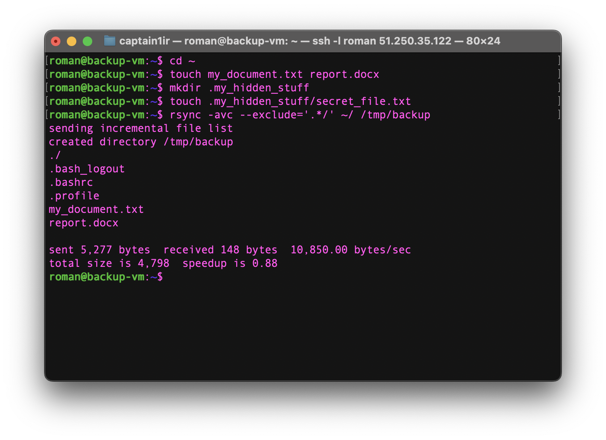
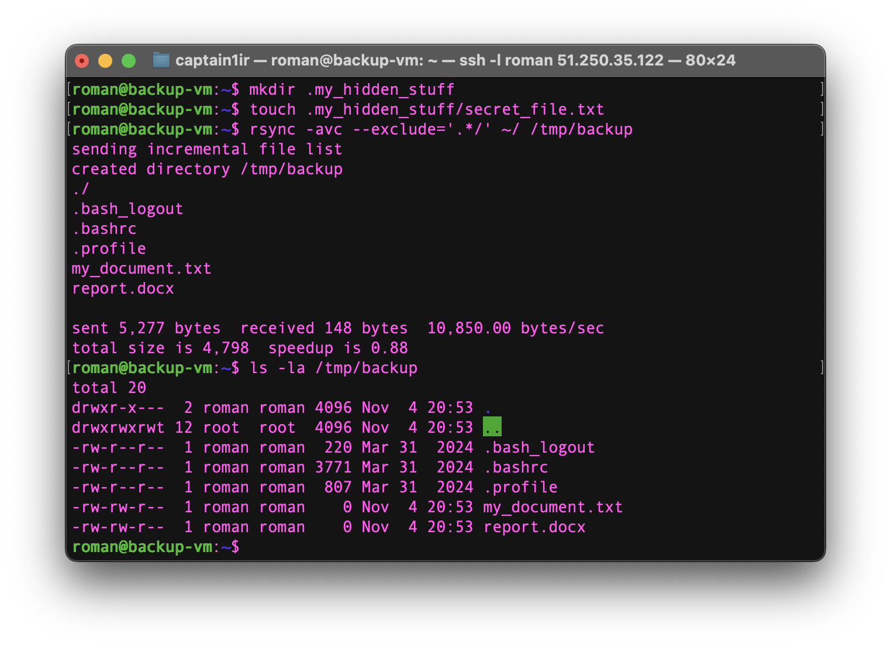
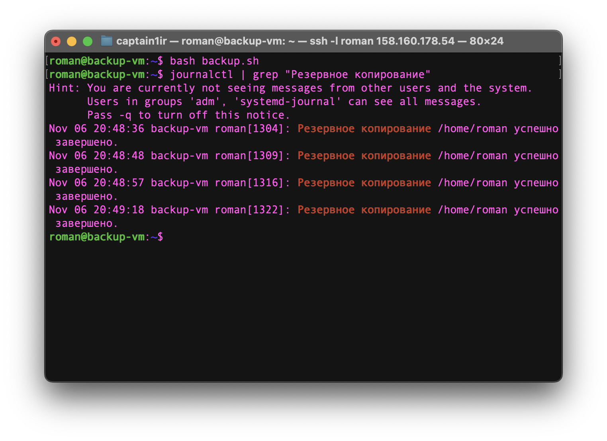
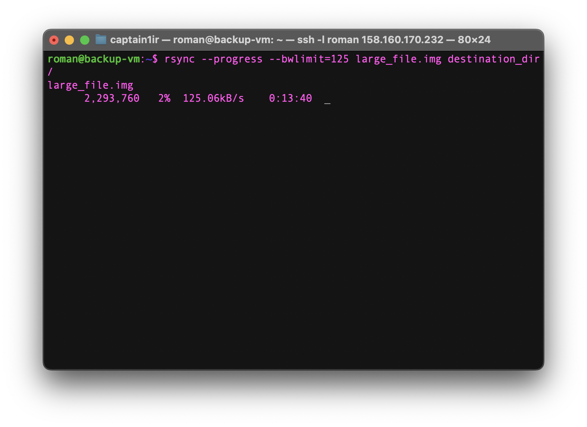

# Домашнее задание к занятию "`Резервное копирование`" - `Захаров Роман `

### Задание 1

> Составьте команду rsync, которая позволяет создавать зеркальную копию домашней директории пользователя в директорию /tmp/backup.
> *   Необходимо исключить из синхронизации все директории, начинающиеся с точки (скрытые).
> *   Необходимо сделать так, чтобы rsync подсчитывал хэш-суммы для всех файлов, даже если их время модификации и размер идентичны в источнике и приемнике.
>
>На проверку направить скриншот с командой и результатом ее выполнения.

**Решение:**
Команда для выполнения задания:
```bash
rsync -avc --delete --exclude=".*" $HOME/ /tmp/backup/
```
`Для решения задачи была составлена команда rsync с набором ключей, отвечающих за создание зеркальной копии, исключение скрытых файлов и принудительную проверку по контрольным суммам.`

1. `Для создания зеркальной копии используется флаг -a (--archive) в связке с --delete.`
2. `Для исключения скрытых файлов и директорий добавлен флаг --exclude=".*".`
3. `Для принудительной проверки по хэш-суммам используется флаг -c (--checksum).`
4. `В качестве источника указана домашняя директория ($HOME/), в качестве назначения - /tmp/backup/.`
5. `Флаг -v (--verbose) добавлен для наглядности вывода.`






### Задание 2

> Написать скрипт и настроить задачу на регулярное резервное копирование домашней директории пользователя с помощью rsync и cron.
> *   Резервная копия должна быть полностью зеркальной
> *   Резервная копия должна создаваться раз в день, в системном логе должна появляться запись об успешном или неуспешном выполнении операции
> *   Резервная копия размещается локально, в директории /tmp/backup
>
> На проверку направить файл crontab и скриншот с результатом работы утилиты.

`Для решения задачи был создан отдельный bash-скрипт, который выполняет резервное копирование и логирует результат. Этот скрипт затем был добавлен в планировщик cron для ежедневного выполнения.`

1.  `Создан скрипт backup.sh, который содержит всю логику операции.`
2.  `Внутри скрипта выполняется команда rsync -a --delete для создания полной зеркальной копии.`
3.  `После выполнения rsync, скрипт анализирует код завершения последней команды ($?).`
4.  `Если код завершения равен 0 (успех), утилита logger отправляет в системный журнал сообщение об успешном завершении.`
5.  `Если код завершения не равен 0 (ошибка), logger отправляет в системный журнал сообщение об ошибке с соответствующим уровнем приоритета.`
6.  `В планировщик cron добавлена задача, которая раз в день (в 00:00) запускает созданный скрипт на выполнение.`

`Код скрипта backup.sh:`

```bash
#!/bin/bash

SOURCE_DIR="$HOME/"

# Назначение: директория для резервной копии
BACKUP_DIR="/tmp/backup/"

rsync -a --delete "$SOURCE_DIR" "$BACKUP_DIR"

if [ $? -eq 0 ]; then
  # Если код завершения 0 (успех), отправляем сообщение в системный лог
  logger "Резервное копирование $HOME успешно завершено."
else
  # Если код завершения не 0 (ошибка), отправляем сообщение об ошибке
  logger -p user.error "ОШИБКА: Резервное копирование $HOME не удалось."
fi
```




### Задание 3*

> Настройте ограничение на используемую пропускную способность rsync до 1 Мбит/c.
> *   Проверьте настройку, синхронизируя большой файл между двумя серверами.
> *   На проверку направьте команду и результат ее выполнения в виде скриншота.

`Для проверки ограничения пропускной способности rsync сначала был создан тестовый файл большого размера, а затем выполнена его синхронизация с использованием опции --bwlimit.`

1.  `С помощью утилиты dd был создан тестовый файл large_file.img размером 100 МБ для наглядной демонстрации процесса копирования.`
2.  `Для ограничения скорости используется ключ --bwlimit. Значение для этого ключа указывается в КИЛОБАЙТАХ в секунду.`
3.  `Было выполнено преобразование: 1 Мбит/с = 1000 Кбит/с. 1000 Кбит/с / 8 = 125 КБайт/с.`
4.  `В команду rsync добавлен ключ --progress для отображения скорости передачи в реальном времени.`
5.  `Была запущена команда копирования файла с ограничением скорости в 125 КБайт/с.`

```bash
# Шаг 1: Создание тестового файла размером 100МБ
dd if=/dev/zero of=large_file.img bs=1M count=100

# Шаг 2: Копирование файла с ограничением скорости до 1 Мбит/с (125 КБ/с)
rsync --progress --bwlimit=125 large_file.img destination_dir/

```





